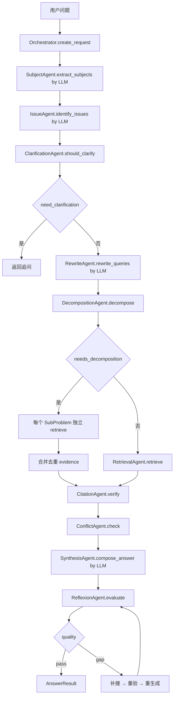
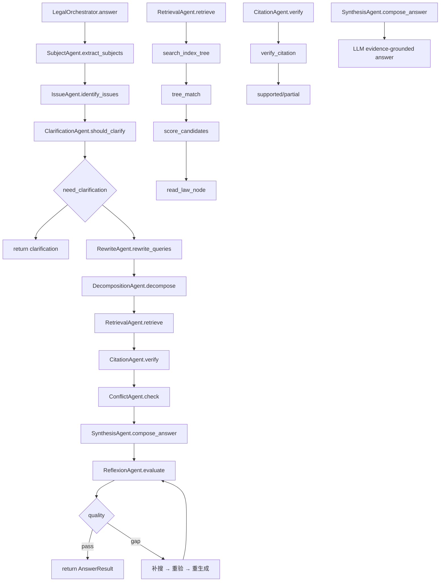
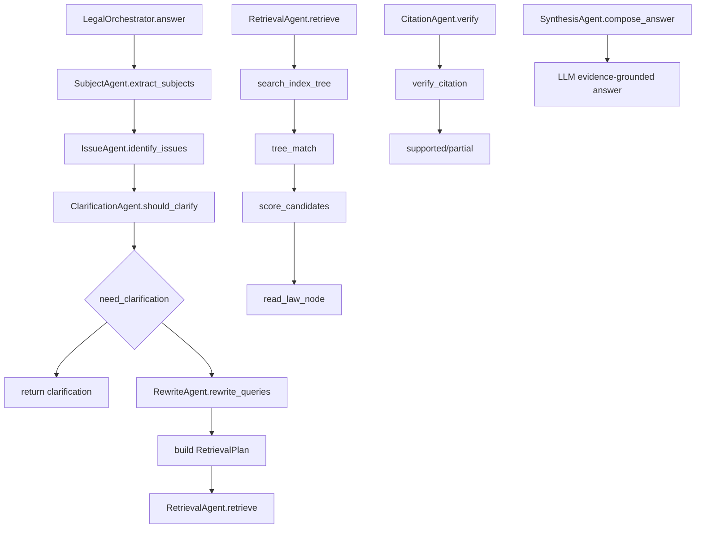
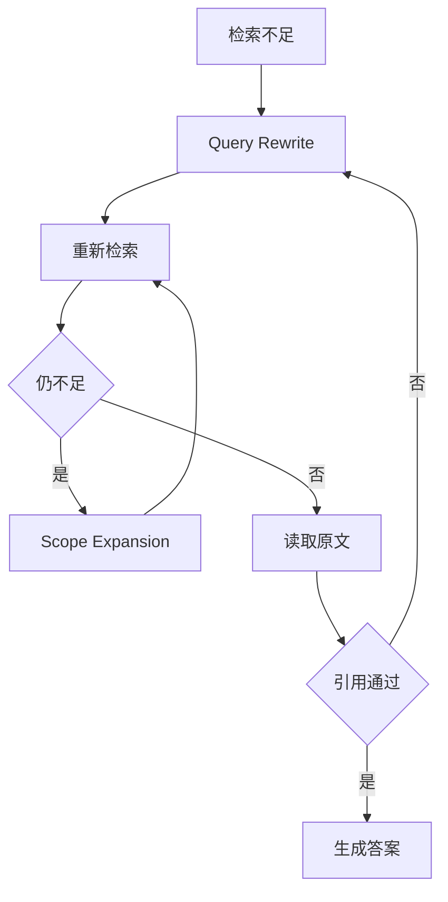

# 劳动法机器人流程图

## 1. 当前已实现流程图

```mermaid
flowchart TD
    A[用户问题] --> B[Orchestrator.create_request]
    B --> C[SubjectAgent.extract_subjects by LLM]
    C --> D[IssueAgent.identify_issues by LLM]
    D --> E[ClarificationAgent.should_clarify]
    E --> F{need_clarification}
    F -- 是 --> G[返回追问]
    F -- 否 --> H[RewriteAgent.rewrite_queries by LLM]
    H --> I[DecompositionAgent.decompose]
    I --> I1{needs_decomposition}
    I1 -- 否 --> J[RetrievalAgent.retrieve]
    I1 -- 是 --> J1[每个 SubProblem 独立 retrieve]
    J1 --> J2[合并去重 evidence]
    J2 --> K[CitationAgent.verify]
    J --> K
    K --> L[ConflictAgent.check]
    L --> M[SynthesisAgent.compose_answer by LLM]
    M --> N[ReflexionAgent.evaluate]
    N --> N1{quality}
    N1 -- pass --> O[AnswerResult]
    N1 -- gap --> N2[补搜 → 重验 → 重生成]
    N2 --> N
```

## 2. 函数级流程图

```mermaid
flowchart TD
    A0[LegalOrchestrator.answer] --> A1[SubjectAgent.extract_subjects]
    A1 --> A2[IssueAgent.identify_issues]
    A2 --> A3[ClarificationAgent.should_clarify]
    A3 --> A4{need_clarification}
    A4 --> A5[return clarification]
    A4 --> A6[RewriteAgent.rewrite_queries]
    A6 --> A6b[DecompositionAgent.decompose]
    A6b --> A7[RetrievalAgent.retrieve]
    A7 --> A8[CitationAgent.verify]
    A8 --> A9[ConflictAgent.check]
    A9 --> A10[SynthesisAgent.compose_answer]
    A10 --> A11[ReflexionAgent.evaluate]
    A11 --> A12{quality}
    A12 -- pass --> A13[return AnswerResult]
    A12 -- gap --> A14[补搜 → 重验 → 重生成]
    A14 --> A11

    C0[RetrievalAgent.retrieve] --> C1[search_index_tree]
    C1 --> C2[tree_match]
    C2 --> C3[score_candidates]
    C3 --> C4[read_law_node]

    E0[CitationAgent.verify] --> E1[verify_citation]
    E1 --> E2[supported/partial]

    F0[SynthesisAgent.compose_answer] --> F1[LLM evidence-grounded answer]
```

## 3. 当前函数级流程图

```mermaid
flowchart TD
    A0[LegalOrchestrator.answer] --> A1[SubjectAgent.extract_subjects]
    A1 --> A2[IssueAgent.identify_issues]
    A2 --> A3[ClarificationAgent.should_clarify]
    A3 --> A4{need_clarification}
    A4 --> A5[return clarification]
    A4 --> A6[RewriteAgent.rewrite_queries]
    A6 --> A7[build RetrievalPlan]
    A7 --> A8[RetrievalAgent.retrieve]

    C0[RetrievalAgent.retrieve] --> C1[search_index_tree]
    C1 --> C2[tree_match]
    C2 --> C3[score_candidates]
    C3 --> C4[read_law_node]

    E0[CitationAgent.verify] --> E1[verify_citation]
    E1 --> E2[supported/partial]

    F0[SynthesisAgent.compose_answer] --> F1[LLM evidence-grounded answer]
```

## 3. 失败回退图

```mermaid
flowchart TD
    A[检索不足] --> B[Query Rewrite]
    B --> C[重新检索]
    C --> D{仍不足}
    D -- 是 --> E[Scope Expansion]
    E --> C
    D -- 否 --> F[读取原文]
    F --> G{引用通过}
    G -- 否 --> B
    G -- 是 --> H[生成答案]
```
